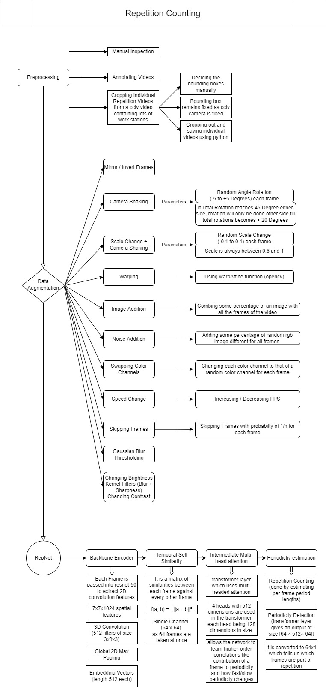
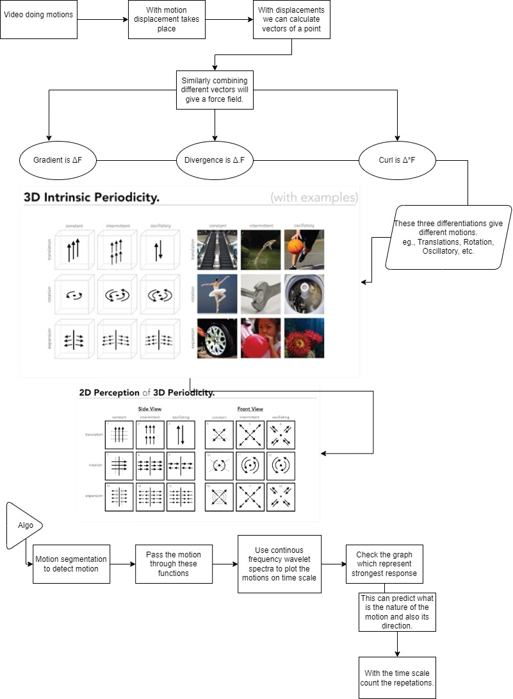
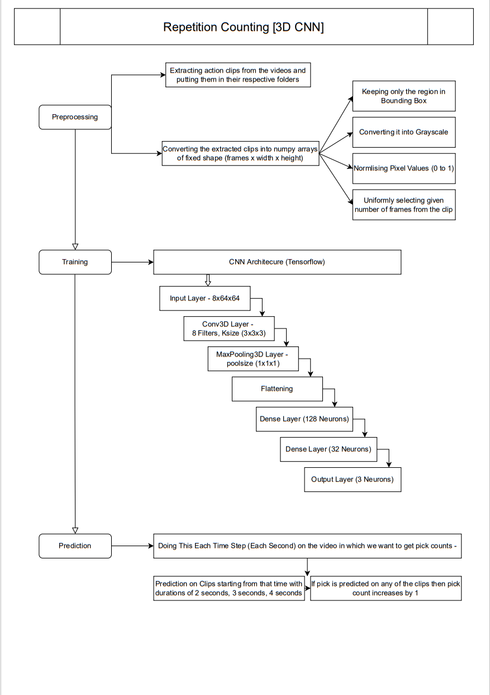

# Repetition_Counting
 
The project aims to make a computer vision based model to count the number of times a repetitive activity was performed and to estimate the time period of a single event cycle.
We want to make a generalized model to count continuous repetitive tasks in the manufacturing line or any other industrial operational process. Our prime objective was to count repetations from a cloth stiching company. 

**Dataset** 

The dataset consist of videos. The content of the video consists of varying periodic activities. The video must also be labelled for classification purposes. To make the dataset robust the videos captures may follow the following criteria:
Videos in a variety of lightning conditions, camera angles and of objects in different orientations.
The proportion of the target item should be higher in the data set.
If the dataset is not labelled for classification purposes, label it using one of the many open source tools available for labeling images.

**Data Augmentation**

Performing data-augmentation techniques to increase the size of the data set. The techniques may involve:
Flipping horizontally
Zooming 
Blurring
More data augmentation techniques have been written in the flowchart below.

**Our approeches: -

**Approach 1: Transfer Learning

**Model**: The model deployed is RepNet. RepNet is developed by Google, for counting repetitions in Videos. The architecture of the model consists of three parts: a frame encoder, an intermediate representation, called a temporal self-similarity matrix, and a period predictor.

**Frame Encoder**: It uses the ResNet architecture as a per-frame model to generate embeddings of each frame of the video.

**Temporal self-similarity matrix (TSM)**: This matrix is calculated by comparing the frame’s embedding with every other frame in the video, returning a matrix that is easy for subsequent modules to analyze for counting repetitions.

**Period Predictor**: For each frame, the Transformers are used to predict the periodicity, that is whether or not a frame is part of the periodic process and the respective period of repetition, directly from the sequence of similarities in the TSM. Then it obtains the per frame count by dividing the number of frames captured in a periodic segment by the period length. Summing this gives the number of repetitions in the video.

**Div, grad and curl**: Another method is to use div, grad and curl for repetition counting. It is a physics based approach in which a force field is generated for all motions in a given video. Then displacement is calculated for all the vectors. And we get a term which can be differentiated, with this term we can calculate div, grad and curl for the moving object. These derivatives can give a sense of 3 types of motion and prolonged such motions give 9 types of motion which can be extended to 18 types when moving from 2D to 3D viewing angle. Then a continuous frequency wavelet spectra is used which will plot the motions on a time scale. And we check for the graph which strongly represents motion, this will predict the actual nature of motion and with the time scale we can predict the count of reparations.

**Approach 2: Average pixel intensity spikes**

This refers to taking the average pixel intensity values of a spatial region in the video and plotting it with respect to time till the end of the video to observe the change of a region’s average pixel value (from 0-255) with time. 
Here we observed that after every stitching cycle was complete, the workers on all the 3 stations (left, center and right table worker) would throw their completed cloth on a table on the other side. We thought that if we can identify when these throws were made, we can count the number of times each worker throws a cloth on the other side which can help us with our initial objective of counting. So for this task we made a rectangular bounding box on all the 3 regions of the video where this throwing was happening (corresponding to the 3 tables in the front camera view). Next we calculated the average pixel intensity values of the regions. Since the cloth being stitched was all white, the average pixel intensity value whenever this cloth was being thrown was very high (closer to 225 compared to normally) as the bounding box while the cloth was being thrown now had almost all the pixels as white or near white due to the cloth occupying the entire bounding box compared to normally when the bounding box contained the background which was more close to darker shades of gray courtesy of the metallic tables. The resulting plot was a graph of pixel intensity vs time showing clearly where the peaks were. We observed that there was a clear peak after every time interval t which was not fixed due to human inconsistencies (worker) but can be worked with if we set a threshold as the gap between 2 peaks was sufficient. But the problem with this approach was that when we tried to specify the bounding box in the region where this throwing action is happening at each table, it also encompassed part of the region where a lot of the part of the cloth being stitched also came in because the cloth needed to be flipped many times during the entire stitching cycle, and this method hence could not differentiate between when the cloth was being flipped and when it was being thrown as peaks were obtained for both flipping and throwing. Many times though, the peak obtained for throwing was higher than that obtained for flipping, but it was inconsistent and not reliable enough to help the program decide when there was throwing and when flipping which resulted in wrong numbers.

**Approach 3: Action Classifier**

Action classifier refers to an AI model that can tell what is the physical action that is happening in a video or in particular frames of videos. It can also predict multiple actions happening in the same video. 
We observed that after each stitching cycle was getting completed, the workers at each of the 3 statons visible in the front view camera angle (the left, center and right table worker) threw the stitched up cloth to the table across them on the other side in the collecting area. So we thought that if we can identify this throwing action in the videos by the workers, then we can also count the number of times they throw the completed cloth pieces on the other side which will help us with our initial objective of counting. The problem with this approach was that many times it was not able to correctly differentiate between throwing of the completed cloth and the worker flipping the cloth in the stitching process, as both of these processes were very similar looking. 
So we decided to focus on another area in the video where the workers were picking the clothes for stitching on the main cloth. We observed that for every piece of main cloth, the workers picked 2 clothes from the bundle kept in front of them. If we can detect properly how many times the worker is picking the cloth from the bundle, we can get the number of times a complete stitching process is happening, which will be half of the number of times the picking process has happened. We decided to train an action classifier that can detect 3 types of action: picking, normal stitching, and person (this class will detect if a person is walking across the region in which the cloth is being stitched). For all the 3 stations in the front view, we obtained 3-6 second clips of all these 3 classes and then used our standard preprocessing and augmentation steps that we have mentioned before to obtain a larger and cleaner dataset which we then trained the model on. The model so obtained was able to detect some of the picking actions happening but oftentimes confused between person and picking.

**Average Pixel Intensity Spikes: results and observations**

This refers to taking the average pixel intensity values of a spatial region in the video and plotting it with respect to time till the end of the video to observe the change of a region’s average pixel value (from 0-255) with time.

Here we take a bounding box and calculate the average pixel value inside it, since the cloth is white there are spikes when the worker picks up a cloth. 

There are false spikes when occlusion occurs. 

**Action Classifier: Results and observations**

For all the 3 stations in the front view, we obtained 3-6 second clips of all these 3 classes and then used our standard preprocessing and augmentation steps that we have mentioned before to obtain a larger and cleaner dataset which we then trained the model on. The model so obtained was able to detect some of the picking actions happening but oftentimes confused between person and picking.

